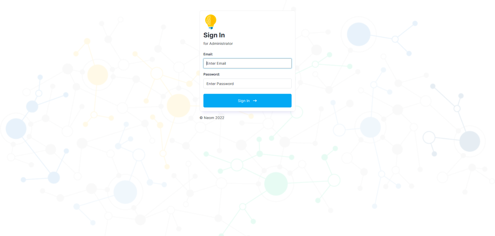
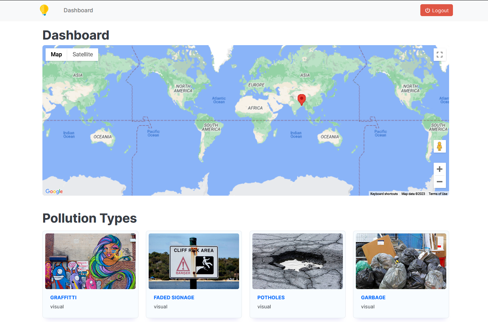
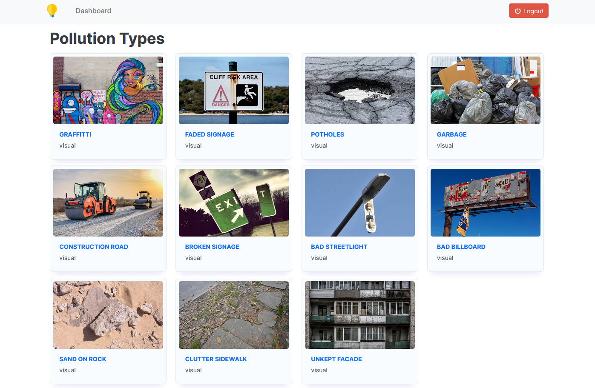
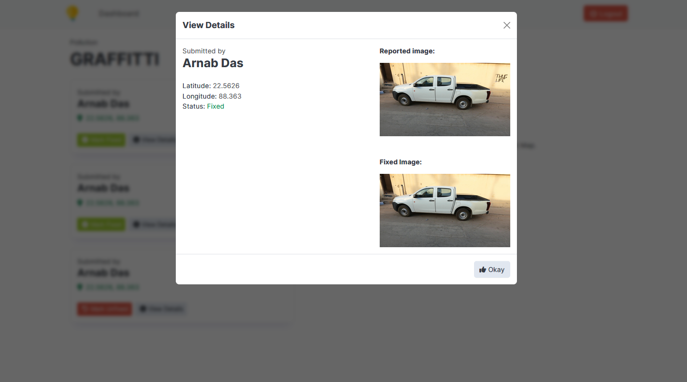
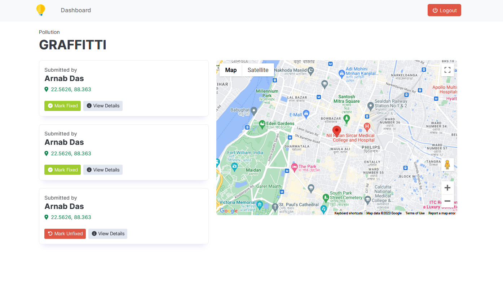
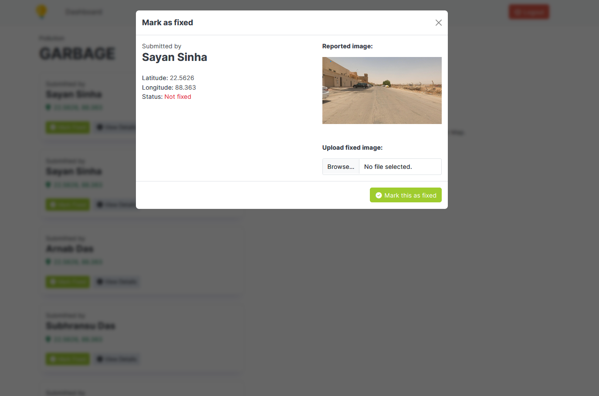

# Client Neom Admin Dashboard for smartathon API

Neom admin dashboard client that utilises smartathon-api for to review the visual pollution data received from car dashcams.

Technology used: React 18, Bootstrap 5.3

Follow the required commands:
1. ```npm install```
2. ```npm start```

# Screenshots






